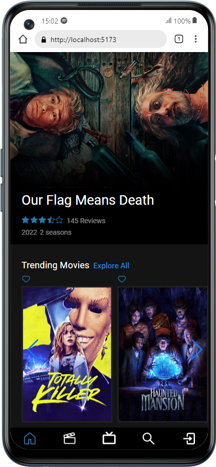
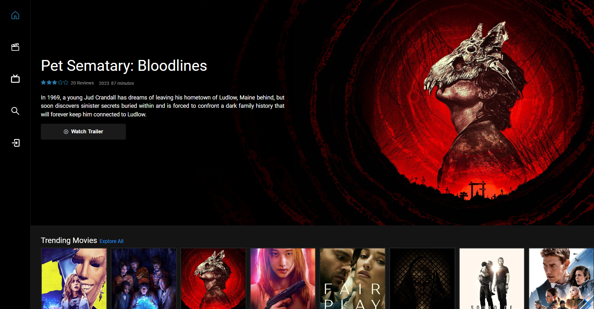

<!-- TABLE OF CONTENTS -->

  
Table of Contents

  <ol>
    <li>
      <ul>
        <a href="#about-the-project">About The Project</a>
        <li><a href="#built-with">Built With</a></li>
      </ul>
    </li>
    <li><a href="#contact">Contact</a></li>
    <li><a href="#acknowledgments">Acknowledgments</a></li>
  </ol>

## About The Project
<h1 align="center">MovieLoop</h1>
MovieLoop is a React-based website that allows the user to search for movies by title, view trending and upcoming movies and bookmark their favorite movies

## Layout mobile

  

## Layout web

  

### Built With

* [![React][React.js]][React-url]
* ![JavaScript][javascript]
* ![HTML][html]
* ![CSS][css]

(<a href="#readme-top">back to top</a>)

<!-- ACKNOWLEDGMENTS -->
## Acknowledgments

* [Img Shields](https://shields.io)
* [React Icons](https://react-icons.github.io/react-icons/search)
* [TMDB API][TMDB-url]

(<a href="#readme-top">back to top</a>)

<!-- CONTACT -->
## Contact

Marcos Henrique de Moraes - mh.moraes@hotmail.com

Linkedin: https://www.linkedin.com/in/marcoshenriquem/

(<a href="#readme-top">back to top</a>)

<!-- MARKDOWN LINKS & IMAGES -->
<!-- https://www.markdownguide.org/basic-syntax/#reference-style-links -->
[React.js]: https://img.shields.io/badge/React-20232A?style=for-the-badge&logo=react&logoColor=61DAFB
[React-url]: https://reactjs.org/
[javascript]: https://img.shields.io/badge/JavaScript-F7DF1E?style=for-the-badge&logo=javascript&logoColor=black
[css]: https://img.shields.io/badge/CSS3-1572B6?style=for-the-badge&logo=css3&logoColor=white
[html]: https://img.shields.io/badge/HTML5-E34F26?style=for-the-badge&logo=html5&logoColor=white
[TMDB-url]: https://developer.themoviedb.org/docs
